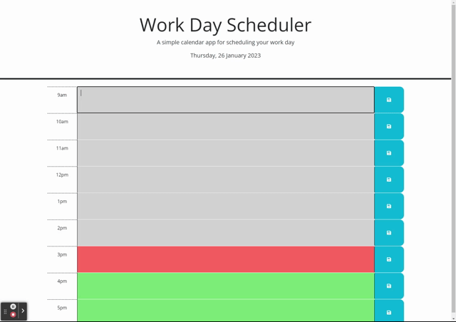

# Work Day Scheduler (Bootcamp Challenge 5)

## Introduction and Purpose:

A rather rudimentary daily planner using the Day.js utility library. I used this exercise as an opportunity to practice DOM traversal using jQuery syntax, dynamic element creation via jQuery and Bootstrap, and manipulation of local storage.

## Scenario:

## Technical Overview:

Based on two constants - the start and duration of the workday - the script generates a variable set of hourly time slots appended to an HTML container by jQuery methods. Each time slot is equipped with a button which commits the contents of its (and only its) associated text area to local storage, where it persists between sessions.

The application obtains the present date and hour via Day.js and dynamically styles the time slots according to whether they are in the past, present, or future relative to the current hour. 

## Results:

The application is currently live on [GitHub Pages](https://tadcos29.github.io/workday-scheduler/) 

The GitHub repository for the project is: https://github.com/tadcos29/workday-scheduler

## Potential Issues:

* There is some potential redundancy in the jQuery calls, mostly for the sake of increased readability.

* The file structure of this repository is questionable, lacking as it does the standard directory structure. I chose do to so to preserve the original flattened structure that came with the assignment.
